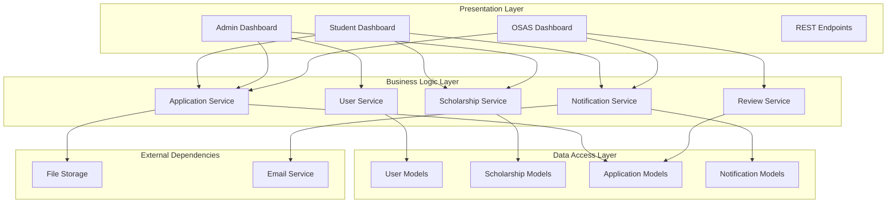
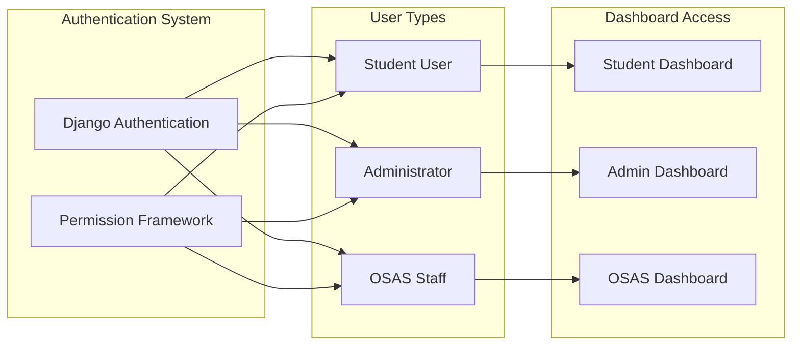
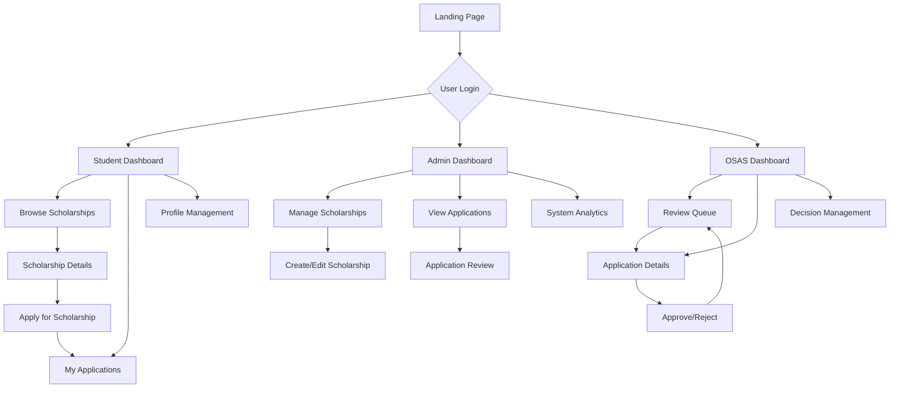
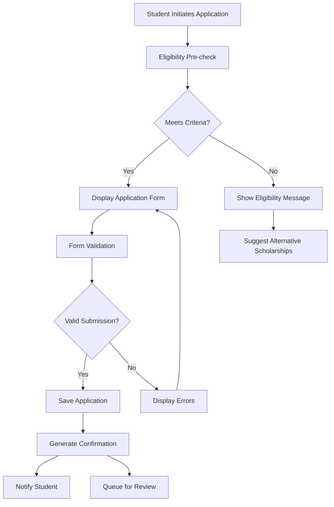
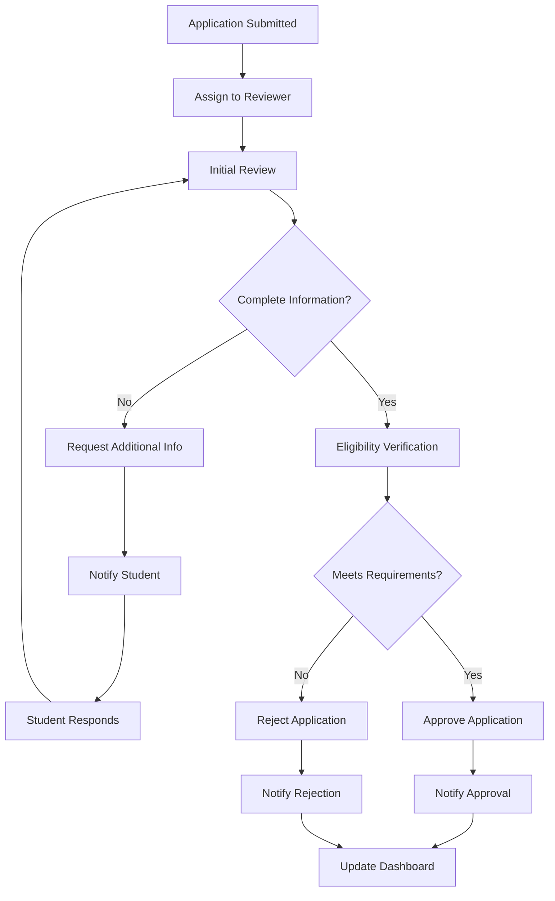

# Scholarship Management System Design

## Overview

The Scholarship Management System is a comprehensive web application built on Django that facilitates the complete lifecycle of scholarship administration. The system serves three distinct user types: Students seeking financial aid opportunities, Administrators managing scholarship programs, and Office of Student Affairs (OSAS) staff reviewing and approving applications.

The system emphasizes modern web technologies including TailwindCSS for styling, HTMX for dynamic server-side interactions, and AlpineJS for client-side reactivity, all while maintaining mobile responsiveness and real-time updates.

### Core Value Proposition

- **Streamlined Application Process**: Students can easily discover, apply for, and track scholarship opportunities
- **Efficient Administration**: Administrators can manage scholarship offerings with comprehensive oversight tools
- **Fair Review Process**: OSAS staff can systematically review applications with complete information access
- **Real-time Collaboration**: All stakeholders receive immediate updates on status changes and important notifications

## Technology Stack & Dependencies

| Component | Technology | Purpose |
|-----------|------------|---------|
| Backend Framework | Django 5.2.5 | Server-side application logic and data management |
| Database | SQLite (development) | Data persistence and relationship management |
| Frontend Styling | TailwindCSS (CDN) | Responsive utility-first CSS framework |
| Dynamic Updates | HTMX | Server-side rendering with AJAX interactions |
| Client Interactivity | AlpineJS | Lightweight reactive components |
| Authentication | Django Auth | User management and session handling |
| File Storage | Django FileField | Document and media management |

## Architecture

### System Architecture Overview

### User Role Architecture

## Data Models & ORM Mapping

### User Profile Extensions

| Field | Type | Purpose | Constraints |
|-------|------|---------|-------------|
| user | OneToOneField(User) | Link to Django User | CASCADE |
| user_type | CharField | Role designation | CHOICES: student, admin, osas |
| student_id | CharField | Academic identifier | Optional, unique |
| department | CharField | Academic department | Optional |
| year_level | CharField | Academic standing | Optional |
| phone_number | CharField | Contact information | Optional |
| created_at | DateTimeField | Account creation | Auto-generated |
| updated_at | DateTimeField | Last modification | Auto-updated |

### Scholarship Entity Model

| Field | Type | Purpose | Constraints |
|-------|------|---------|-------------|
| title | CharField | Scholarship name | Max 200 chars, required |
| description | TextField | Detailed information | Required |
| eligibility_criteria | TextField | Application requirements | Required |
| award_amount | DecimalField | Financial value | Max digits: 10, decimal: 2 |
| application_deadline | DateTimeField | Submission cutoff | Required |
| available_slots | PositiveIntegerField | Number of recipients | Default: 1 |
| is_active | BooleanField | Availability status | Default: True |
| created_by | ForeignKey(User) | Administrator | CASCADE |
| created_at | DateTimeField | Creation timestamp | Auto-generated |
| updated_at | DateTimeField | Modification timestamp | Auto-updated |

### Application Management Model

| Field | Type | Purpose | Constraints |
|-------|------|---------|-------------|
| student | ForeignKey(User) | Applicant reference | CASCADE |
| scholarship | ForeignKey(Scholarship) | Target scholarship | CASCADE |
| status | CharField | Current state | CHOICES: pending, under_review, approved, rejected |
| personal_statement | TextField | Student essay | Required |
| gpa | DecimalField | Academic performance | Max digits: 4, decimal: 2 |
| supporting_documents | FileField | Required documents | Upload path: applications/ |
| additional_info | TextField | Supplementary data | Optional |
| submitted_at | DateTimeField | Submission timestamp | Auto-generated |
| reviewed_at | DateTimeField | Review completion | Optional |
| reviewed_by | ForeignKey(User) | OSAS reviewer | Optional, CASCADE |
| reviewer_comments | TextField | Decision rationale | Optional |

### Notification System Model

| Field | Type | Purpose | Constraints |
|-------|------|---------|-------------|
| recipient | ForeignKey(User) | Target user | CASCADE |
| title | CharField | Notification subject | Max 200 chars |
| message | TextField | Notification content | Required |
| notification_type | CharField | Category classification | CHOICES: info, warning, success, error |
| is_read | BooleanField | Read status | Default: False |
| related_application | ForeignKey(Application) | Context reference | Optional, CASCADE |
| created_at | DateTimeField | Creation timestamp | Auto-generated |

## Component Architecture

### Student Dashboard Components

#### Scholarship Browser Component
- **Purpose**: Display available scholarships with filtering and search capabilities
- **Data Sources**: Active scholarships, user eligibility matching
- **Interactive Elements**: Search bar, filter dropdowns, pagination
- **Real-time Updates**: New scholarship notifications via HTMX

#### Application Tracker Component
- **Purpose**: Show current application status and progress
- **Data Sources**: User applications, status updates, deadlines
- **Interactive Elements**: Status indicators, progress bars, action buttons
- **Real-time Updates**: Status changes, reviewer comments

#### Dashboard Analytics Component
- **Purpose**: Personal scholarship statistics and recommendations
- **Data Sources**: Application history, success rates, matching scholarships
- **Interactive Elements**: Charts, recommendation cards
- **Real-time Updates**: New matches, deadline alerts

### Administrator Dashboard Components

#### Scholarship Management Component
- **Purpose**: CRUD operations for scholarship offerings
- **Data Sources**: All scholarships, application statistics
- **Interactive Elements**: Create/edit forms, delete confirmations, status toggles
- **Real-time Updates**: Application count updates, deadline monitoring

#### Application Overview Component
- **Purpose**: Monitor all applications across scholarships
- **Data Sources**: Applications with student details, review status
- **Interactive Elements**: Filtering, sorting, bulk actions
- **Real-time Updates**: New applications, status changes

#### Statistics Dashboard Component
- **Purpose**: System-wide analytics and reporting
- **Data Sources**: Application metrics, scholarship performance, user activity
- **Interactive Elements**: Date range selectors, export functions
- **Real-time Updates**: Live statistics, trending data

### OSAS Dashboard Components

#### Review Queue Component
- **Purpose**: Manage pending application reviews
- **Data Sources**: Pending applications, student profiles, documents
- **Interactive Elements**: Review forms, document viewers, decision buttons
- **Real-time Updates**: New applications, review assignments

#### Decision Management Component
- **Purpose**: Approve, reject, or request additional information
- **Data Sources**: Application details, eligibility verification
- **Interactive Elements**: Decision forms, comment fields, notification triggers
- **Real-time Updates**: Immediate status updates across all dashboards

## Routing & Navigation

### URL Structure

| Pattern | View | Purpose | Access Level |
|---------|------|---------|--------------|
| `/` | landing_page | System introduction | Public |
| `/dashboard/` | dashboard_router | Role-based dashboard redirect | Authenticated |
| `/student/` | student_dashboard | Student interface | Student only |
| `/admin/` | admin_dashboard | Administrator interface | Admin only |
| `/osas/` | osas_dashboard | OSAS staff interface | OSAS only |
| `/scholarships/` | scholarship_list | Browse scholarships | Student |
| `/scholarships/<id>/` | scholarship_detail | Individual scholarship | Student |
| `/applications/` | application_list | Manage applications | Student/OSAS |
| `/applications/<id>/` | application_detail | Application details | Student/OSAS |
| `/apply/<scholarship_id>/` | create_application | New application | Student |

### Navigation Flow

## Styling Strategy

### TailwindCSS Implementation
- **CDN Integration**: TailwindCSS loaded via CDN for rapid development and minimal build complexity
- **Utility-First Approach**: Consistent spacing, colors, and responsive design through utility classes
- **Component Consistency**: Standardized button styles, form elements, and card layouts
- **Responsive Grid System**: Mobile-first design using Tailwind's responsive prefixes

### Custom CSS Minimization
- **Utility Extensions**: Custom utilities only when Tailwind lacks specific functionality
- **Component-Specific Styles**: Minimal custom CSS for complex animations or unique layouts
- **CSS Variables**: Brand colors and spacing defined as CSS custom properties

### Color Scheme and Branding

| Element | Color Class | Purpose |
|---------|-------------|---------|
| Primary Actions | `bg-blue-600 hover:bg-blue-700` | Main interactive elements |
| Success States | `bg-green-600 hover:bg-green-700` | Positive feedback |
| Warning States | `bg-yellow-500 hover:bg-yellow-600` | Attention required |
| Error States | `bg-red-600 hover:bg-red-700` | Error conditions |
| Neutral Actions | `bg-gray-600 hover:bg-gray-700` | Secondary actions |

## API Integration Layer

### HTMX Integration Strategy

#### Dynamic Content Updates
- **Application Status Changes**: Real-time status updates without page refresh
- **Form Submissions**: Inline validation and submission feedback
- **Notification Display**: Toast notifications for immediate user awareness
- **Dashboard Metrics**: Live updating statistics and counters

#### HTMX Endpoint Patterns

| Endpoint | Method | Purpose | Response |
|----------|--------|---------|----------|
| `/htmx/scholarships/` | GET | Load scholarship cards | HTML Fragment |
| `/htmx/applications/status/` | GET | Update application status | HTML Fragment |
| `/htmx/notifications/` | GET | Fetch new notifications | HTML Fragment |
| `/htmx/apply/<id>/` | POST | Submit application | HTML Fragment |
| `/htmx/review/<id>/` | POST | Submit review decision | HTML Fragment |

### AlpineJS Reactive Components

#### Interactive Elements
- **Modal Dialogs**: Application details, confirmation dialogs
- **Dropdown Menus**: Filtering options, user account menus
- **Tab Navigation**: Dashboard sections, application stages
- **Form Validation**: Real-time input validation and feedback

#### State Management Patterns
- **Local Component State**: Individual form states, UI toggles
- **Shared Data**: User preferences, notification counts
- **Event Handling**: Click handlers, form submissions, keyboard navigation

## Business Logic Layer

### Scholarship Service Architecture

#### Scholarship Lifecycle Management
- **Creation Workflow**: Validation of scholarship parameters, eligibility criteria parsing
- **Activation Control**: Automated activation/deactivation based on deadlines
- **Capacity Management**: Available slot tracking and application limits
- **Search and Filtering**: Eligibility matching, keyword search, category filtering

#### Eligibility Verification Engine
- **Criteria Parsing**: Dynamic evaluation of student qualifications against scholarship requirements
- **GPA Validation**: Academic performance verification against minimum requirements
- **Department Matching**: Academic program alignment with scholarship focus areas
- **Year Level Requirements**: Academic standing verification for year-specific scholarships

### Application Processing Service

#### Application Submission Flow

#### Document Management
- **File Upload Validation**: Document type verification, size limits, virus scanning
- **Storage Organization**: Structured file paths by application and document type
- **Access Control**: Role-based document access and download permissions
- **Backup and Retention**: Document archival and compliance with data retention policies

### Review and Approval Service

#### OSAS Review Workflow

#### Decision Support System
- **Automated Checks**: GPA verification, deadline compliance, document completeness
- **Review Guidelines**: Standardized criteria and scoring rubrics
- **Audit Trail**: Complete history of review actions and decisions
- **Batch Processing**: Bulk operations for similar applications

### Notification and Communication Service

#### Real-time Notification Engine
- **Event Triggers**: Application submissions, status changes, deadline reminders
- **Multi-channel Delivery**: In-app notifications, email alerts, dashboard updates
- **Personalization**: User-specific notification preferences and filtering
- **Delivery Tracking**: Read receipts, delivery confirmation, retry mechanisms

#### Communication Templates
- **Application Confirmations**: Automated acknowledgment messages
- **Status Updates**: Standardized notification formats for different outcomes
- **Deadline Reminders**: Proactive alerts for approaching deadlines
- **Decision Notifications**: Formal approval/rejection communications

## Testing Strategy

### Unit Testing Framework

#### Model Testing
- **Data Validation**: Field constraints, relationship integrity, custom validators
- **Business Logic**: Eligibility calculations, status transitions, deadline management
- **Permission Systems**: Role-based access control, data isolation
- **Edge Cases**: Boundary conditions, invalid inputs, concurrent operations

#### View Testing
- **Authentication**: Login requirements, role-based access, session management
- **Form Processing**: Input validation, error handling, success responses
- **API Endpoints**: HTMX responses, data serialization, error codes
- **Dashboard Logic**: Data aggregation, filtering, pagination

#### Service Testing
- **Scholarship Management**: Creation, modification, activation workflows
- **Application Processing**: Submission validation, status updates, document handling
- **Notification System**: Event triggering, message delivery, preference handling
- **Review Workflows**: Assignment logic, decision processing, audit trails

### Integration Testing

#### Database Integration
- **Transaction Management**: Rollback scenarios, concurrent access, data consistency
- **File Storage**: Upload/download operations, permission handling, cleanup
- **Email Services**: Delivery testing, template rendering, error handling
- **External Dependencies**: Third-party service integration, fallback mechanisms

#### User Interface Testing
- **Cross-browser Compatibility**: Modern browser support, graceful degradation
- **Responsive Design**: Mobile device testing, layout adaptation
- **HTMX Functionality**: Dynamic updates, form submissions, error handling
- **AlpineJS Components**: Interactive elements, state management, event handling

### Performance Testing

#### Load Testing Scenarios
- **Concurrent Applications**: Multiple students applying simultaneously
- **Dashboard Loading**: Real-time updates under high user load
- **File Upload Stress**: Large document uploads, multiple concurrent uploads
- **Database Queries**: Complex filtering, reporting, and analytics operations

#### Optimization Targets
- **Page Load Times**: Under 2 seconds for dashboard loading
- **Form Submissions**: Under 1 second for application submissions
- **Real-time Updates**: Under 500ms for HTMX responses
- **File Operations**: Efficient handling of documents up to 10MB
